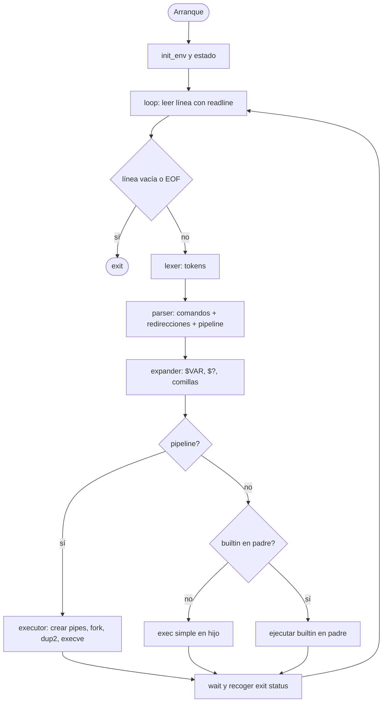
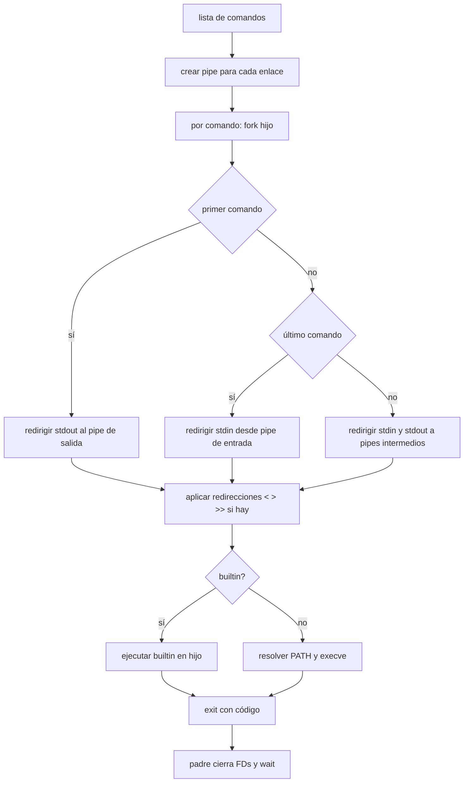
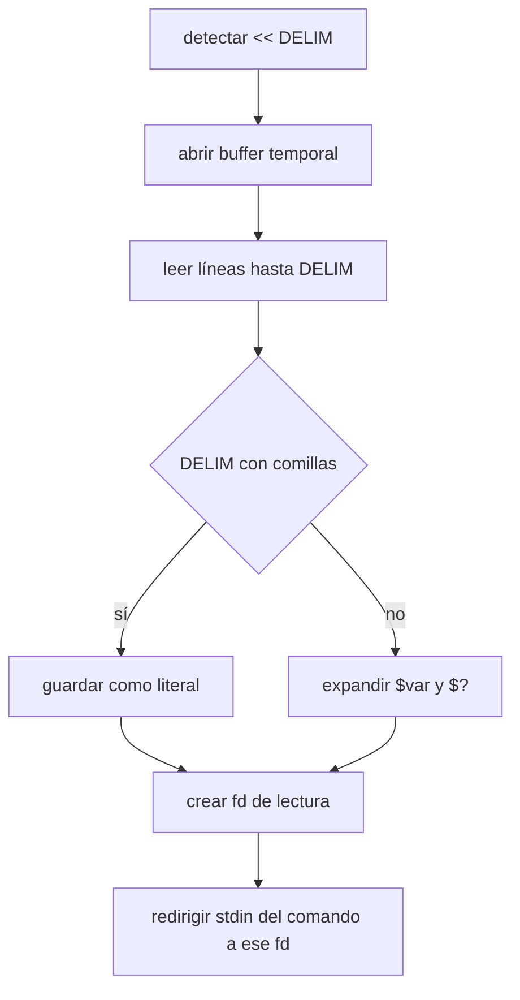

# 🐚 Minishell – 42

Una mini shell en C que replica el comportamiento básico de **bash**: lectura interactiva, **pipes**, **redirecciones**, **heredoc**, **expansión de variables**, **comillas**, **señales** y **builtins** totalmente integrados.

> Objetivo: entender cómo se conecta todo bajo el capó: **tokenización → parsing → expansión → ejecución** con **fork/execve/dup2** y sincronización adecuada de **señales**.

---

## ✨ Características

- **Interfaz interactiva** con *readline* (historial incluido).
- **Pipelines** (`cmd1 | cmd2 | cmd3`).
- **Redirecciones**: `>`, `>>`, `<`.
- **Heredoc**: `<< DELIM` (con expansión de `$var` cuando procede).
- **Comillas**: simples (`'`) y dobles (`"`), con semánticas correctas.
- **Expansión**: `$VAR`, `$?` (exit status).
- **Variables de entorno**: `ENV`, `PATH`, exportación dinámica.
- **Builtins integrados** (sin *execve*): `echo`, `cd`, `pwd`, `export`, `unset`, `env`, `exit`.
- **Señales**: `Ctrl-C`, `Ctrl-D`, `Ctrl-\` con comportamientos diferenciados en *prompt* y en hijos.
- **Códigos de salida** compatibles con bash.

---

## ⚙️ Compilación

```bash
make
```

Esto genera el ejecutable (target):  
```bash
./minishell
```

Limpieza:
```bash
make clean
make fclean
make re
```

---

## ▶️ Uso básico

```bash
./minishell
minishell$ echo "hello $USER"
minishell$ export COLOR=blue
minishell$ echo $COLOR
minishell$ ls -l | grep "\.c" > sources.txt
minishell$ cat << EOF
> line 1
> $USER expands here
> EOF
minishell$ exit
```

---

## 🧰 Builtins soportados

| Comando  | Descripción breve |
|----------|-------------------|
| `echo`   | Imprime argumentos; `-n` suprime salto de línea |
| `cd`     | Cambia de directorio, gestiona `PWD` y `OLDPWD` |
| `pwd`    | Muestra el directorio actual |
| `export` | Define variables de entorno (`KEY=VALUE`) |
| `unset`  | Elimina variables del entorno |
| `env`    | Lista el entorno actual |
| `exit`   | Cierra la shell con código de salida |

> Los **builtins** se ejecutan **en el proceso padre** cuando no van en *pipeline*, para que afecten al entorno de la shell (ej: `cd`, `export`, `unset`). Si forman parte de un *pipeline*, pueden ejecutarse en hijo con el efecto esperado en la tubería.

---

## 🧠 Arquitectura

- **Lexer**: separa la línea en **tokens** respetando comillas y operadores (`|`, `>`, `>>`, `<`, `<<`).  
- **Parser**: construye una **AST** o una lista de **nodos comando** con sus redirecciones y enlaces de *pipeline*.  
- **Expander**: resuelve **variables**: `$VAR`, `$?`, y aplica semántica de comillas.  
- **Executor**: crea *pipelines*, **duplica FDs**, **forkea** y **execve**; ejecuta **builtins** cuando corresponde.  
- **Env**: almacén y utilidades del entorno (alta, baja, búsqueda, `PATH`).  
- **Heredoc**: lectura hasta delimitador, con o sin expansión.  
- **Signals**: control diferenciado en **prompt** y **procesos hijo**.

---

## 🔁 Flujo general de la shell



---

## 🧵 Ejecución y pipelines



---

## 📦 Heredoc y expansión

- `<< DELIM` abre un **canal temporal** en el que el usuario escribe hasta teclear `DELIM`.  
- Si `DELIM` **no está entre comillas**, se **expande** `$VAR` y `$?` en el contenido del heredoc.  
- Si `DELIM` **está entre comillas**, el contenido **no se expande**.  
- El heredoc se conecta al `stdin` del comando objetivo.



---

## 💥 Señales

- **En el prompt**:  
  - `Ctrl-C` → limpia la línea y muestra un prompt nuevo (exit status 130).  
  - `Ctrl-D` → `EOF` → sale si la línea está vacía.  
  - `Ctrl-\` → ignorado.

- **En procesos hijo** (durante `execve`):  
  - `Ctrl-C` y `Ctrl-\` se comportan como en bash (terminan o interrumpen al proceso), y el **exit status** se propaga a `$?`.

---

## 🧩 Errores y códigos de salida

- Comando no encontrado → `127`  
- Permiso denegado → `126`  
- Uso de `exit` con argumento no numérico → `255`  
- Señales: `130` (SIGINT), `131` (SIGQUIT), etc.

---

## 🧱 Estructura sugerida del repo (resumen)

```
minishell/
├─ Makefile
├─ src/
│  ├─ lexer/       # tokenización
│  ├─ parser/      # construcción de comandos o AST
│  ├─ expander/    # expansión de variables y comillas
│  ├─ executor/    # pipelines, redirecciones, execve, builtins
│  ├─ heredoc/     # here-doc con o sin expansión
│  ├─ env/         # tabla de entorno, export/unset
│  ├─ signals/     # handlers y modos de señal
│  └─ utils/       # auxiliares, libft extendida
├─ include/        # headers
└─ libft/          # libft 42 
```


---

## 🧪 Ejemplos de prueba rápidos

```bash
# 1) builtins y expansión
echo "hi $USER" ; pwd ; export A=42 ; echo $A ; unset A ; echo $A

# 2) redirecciones y append
echo hello > a.txt ; echo world >> a.txt ; cat < a.txt

# 3) pipelines
ls -l | grep '\.c' | wc -l

# 4) heredoc con expansión
cat << EOF | grep "$USER"
hola
$USER aparece aqui
EOF

# 5) errores comunes
/bin/false | echo ok ; echo $?
cmd_inexistente ; echo $?
```

---

## ✅ Notas de calidad (42)

- Sin **leaks** (comprueba heredocs y cierres de FDs).  
- Cumple **Norminette**.  
- Manejo estricto de **FDs** en todo el pipeline.  
- **Builtins** correctos en padre (cuando procede) y en hijo si van en pipeline.  
- Expansión coherente con bash, especialmente en **heredoc**.
